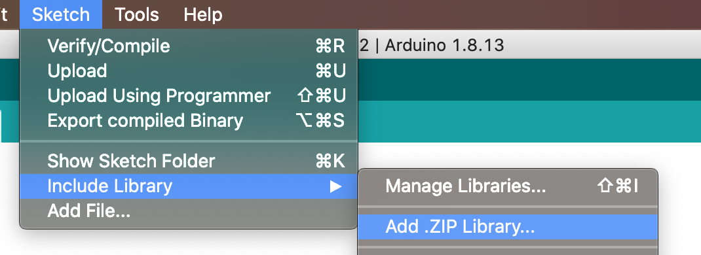
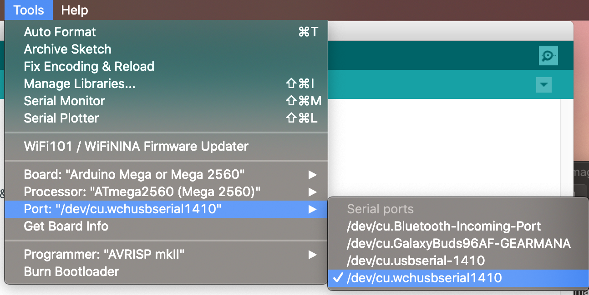
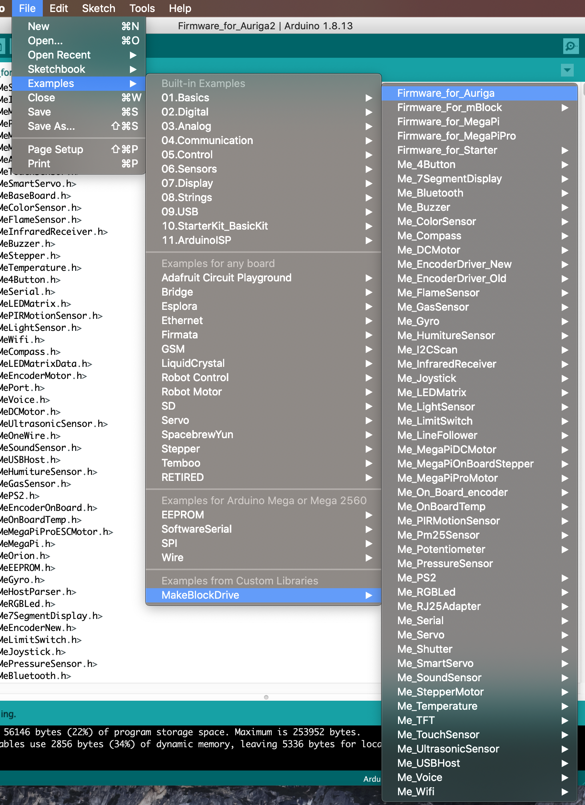
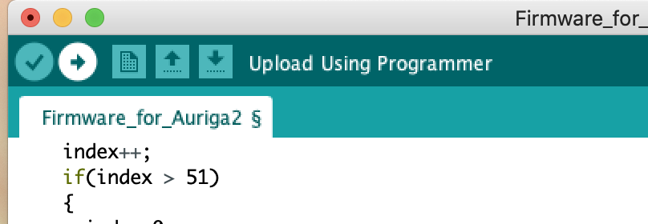

# 🤖 Mbot Ranger Set Up For Arduino C Programming
## Description
This is a guide to help you qucikly set up the Arduino IDE and connect it to the Mbot Ranger for programming in Arduino C using Mac or Linux. Its probably fair to assume that it will also work on Windows as well. I put this together because I felt that the documentation online was not consistent and am confident it will help you get up running in less than hour rather than days, using our teams lessons learned.  
## Steps
1. This [MakeBlock tutorital](http://learn.makeblock.com/en/learning-arduino-programming/) is a great starting point. Use it to get a brief overview of what you will be doing. \ 
   **Note: I found that in the tutorial listed above I did not need the driver for Mac in order for it to run. I would suggest skipping this step if you come accross a need for this step please share it. Step 2 in the MakeBlock tutorial came off to me as instructing the user to copy and paste folders into directories that didnt specifically exist. I would also not reccomend following this step (Refer to Step 5 of this documentation.) **
2. Download the [Arduino IDE](https://www.arduino.cc/en/software), you can also use the link in the tutorial above or just google Arduino IDE
3. Install Arduino IDE\
   Linux: \
   a. Extract the download into a folder of your choice.\
   b. Navigate(cd) into the extracted folder from the terminal.\
   c. Run 
   ```terminal 
    ./install.sh
    ```
   d. Configure system dialout group **Note This step is for Linux only and is indepent of Arduino, but neccessary. It allows your Linux user to access your usb ports**
    ```terminal 
       sudo addusr <username> dialout
    ```
   Mac:\
   a. Double click the compressed folder. This should give you the option to extract.\
   b. Mac will automatically generate an application shortcut in the current folder. 
4. Download [the MakeBlock firmware](https://github.com/Makeblock-official/Makeblock-Libraries/archive/master.zip) you can also find the link in the tutorial in Step 1 the library is hosted on github at the Makeblock-official account. 
5. Install the library. This step was a time drain for me I reccomend you refer to the README.md in the Makeblock Library .zip
rather than the previoulsy referenced MakeBlock tutorial. I will also guide you through the steps here. \
   a. Open Arduino IDE \
   b. Go to Sketch->Include Library ->Add .zip Library Select the zip you downloaded in the previous step.  
   c. Restart Arduino IDE **Note: If you performed these steps correctly  you should be able to navigate to Include Library and see MakeBlockDrive in the list of libraries.**   
 Adding Library 
  
 6. Connect your Mbot Ranger using USB and turn the Mbot Ranger On.
 7. Configure Android IDE for the Mbot Ranger Andruino board.  
    a. Set Tools->Board to "Andruino Mega or Mega 2560" \
    b. Set Tools->Processor to "ATmega2560 (Mega 2560)" \
    c. Set Tools->Port to the appropriate port.  
 **Note My port #'s Linux:dev/ttyUSB0 Mac:(pictured below) These may be diffferent across systems. The port number is highlighted, but the board and processor configurations are also pictured below.**
  
 8. Install the firmware into your MBot Ranger.  
    a. File->Examples->MakeBlockDrive->Firmware_for_Auriga (ME Auriga is the board on the Mbot Ranger).  
    b. The code will appear in the IDE with mbot Ranger connected via USB and Powered ON. Select upload.    
    c. The Andruino IDE will begin compiling and uploading, a blue light on the robot will begin to quickly flash, and the robot will make a sound when the upload is complete.    

Firmware Configuration
 
 
 Select Upload 
 
 

10. Test. The process is complete. Now test coding on your Mbot Ranger.  
    a. Add the code below into a copied and saved version of the Firmware_for_Auriga program in the begining of the existing void loop() function.
         
       ```
      void loop(){
      led.setColor(0, 255, 255, 255)  
      led.show()  
      ...}
      
      ```
    b. Upload the code to your robot again. The process worked if the robot's LED ring lights up and stays on.   
    


        
    
